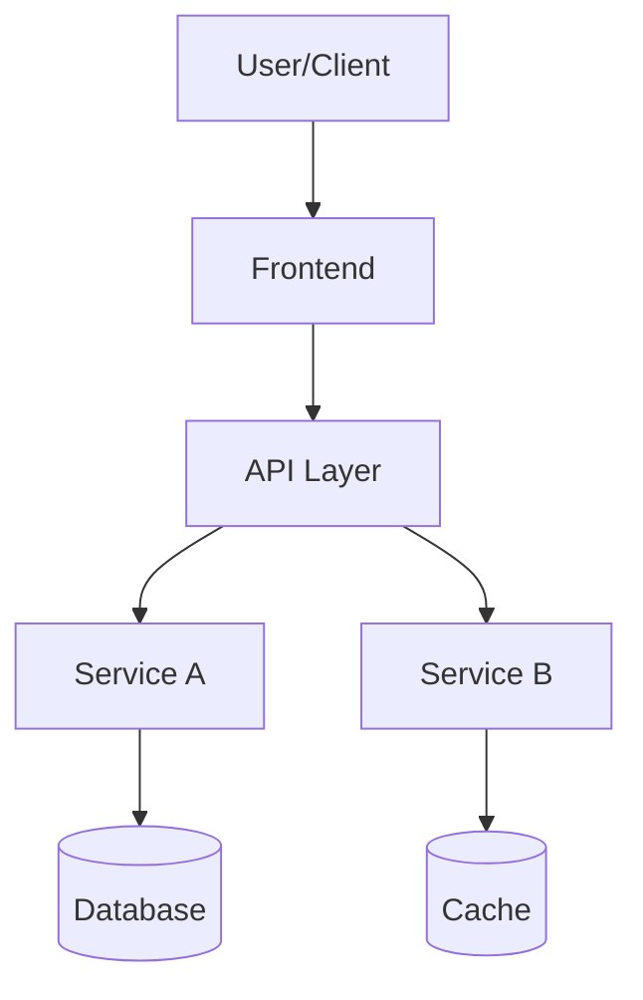

# Architecture Overview Template

Project-level architecture documentation. Create as `docs/ARCHITECTURE.md` or `docs/overview/ARCHITECTURE.md`.

## Purpose

Provides LLM with complete application context to:

- Understand existing system before proposing changes
- Avoid suggesting unnecessary features or over-engineering
- Align new features with current architecture
- Prevent hallucinating non-existent components

## Template Structure

### Application Overview

**What does this application do?**

- Primary purpose and user problems solved
- Target users and key use cases
- Core value proposition
- What this app is NOT (explicit non-goals)

### High-Level Architecture



- Main architectural layers (presentation, business logic, data)
- Communication patterns (REST, GraphQL, WebSocket, etc.)
- Data flow overview
- Deployment architecture (mobile, web, backend services)

### Technology Stack

**Current Technologies**

- Frontend: Framework, libraries, tools
- Backend: Language, framework, database
- Infrastructure: Hosting, CI/CD, monitoring
- Third-party integrations

**Technology Decisions & Rationale**

- Why chosen over alternatives
- Constraints that led to choices
- Trade-offs accepted

### Core Components

**Major System Components**
List 5-10 critical components with:

- Component name and responsibility
- Input/output interfaces
- Dependencies on other components
- Location in codebase

Example:

- **Authentication Service** (`backend/auth/`)
  - Handles user login/logout, token management
  - Depends on: User database, Redis cache
  - Used by: All API endpoints requiring auth

### Data Architecture

**Core Entities**

- User, Product, Order, etc.
- Key relationships between entities
- Data storage strategy (SQL, NoSQL, caching)

**Data Flow**

- How data moves through the system
- External data sources/sinks
- Data transformation points

### Integration Points

**External Services**

- Third-party APIs used
- Purpose and criticality
- Failure handling strategy

**Internal Boundaries**

- Module/service boundaries
- Communication protocols
- API contracts

### Design Patterns & Principles

**Applied Patterns**

- Architectural patterns (MVC, MVVM, Clean Architecture, etc.)
- Design patterns in use
- Coding conventions

**Architecture Principles**

- Separation of concerns approach
- Dependency management rules
- Error handling philosophy
- Testing strategy

### Constraints & Limitations

**Technical Constraints**

- Performance requirements
- Scalability limits
- Technology limitations

**Business Constraints**

- Compliance requirements (GDPR, HIPAA, etc.)
- Budget/resource constraints
- Timeline pressures

### Evolution & Roadmap

**Current State**

- What's implemented
- Known technical debt
- Areas needing improvement

**Future Direction**

- Planned architectural changes
- Features in pipeline
- Deprecation plans

## Example: Android Scanning App

```markdown
# Cozrum Scan - Architecture Overview

## Application Overview

3D object scanning Android app using Insta360 cameras. Captures 360° imagery, processes point clouds, generates 3D models.

**Primary Users**: Professionals needing 3D capture (real estate, construction, e-commerce)
**Core Use Case**: Scan physical objects/spaces → Generate 3D models
**NOT**: General photo editing, social media, AR gaming

## Technology Stack

- **Android**: Kotlin, Jetpack Compose, Clean Architecture + MVVM
- **Camera**: Insta360 SDK, Camera2 API
- **Processing**: Native C++ (JNI), OpenCV, point cloud processing
- **Storage**: Room database, local file system
- **Backend**: [Specify if exists]

## Core Components

1. **Camera Controller** (`app/src/main/java/com/cozrum/scan/camera/`)

   - Insta360 camera connection and control
   - Capture orchestration

2. **Scan Pipeline** (`app/src/main/cpp/`)

   - Native image processing
   - Point cloud generation
   - 3D reconstruction

3. **Scan Storage** (`app/src/main/java/com/cozrum/scan/data/`)
   - Scan metadata persistence
   - File management

## Constraints

- Android 8.0+ (API 26+)
- Requires Insta360 camera hardware
- Heavy compute for 3D processing
- Large file sizes (images + point clouds)

## Design Principles

- Clean Architecture with MVVM
- Unidirectional data flow
- Reactive state with Kotlin Flow
- Offline-first
```

## Usage

Create architecture overview early in project lifecycle. Update when:

- Major architectural changes occur
- New core components added
- Technology stack changes
- Constraints evolve

**LLM Instruction**: Always read `docs/ARCHITECTURE.md` before proposing features or architectural changes.
